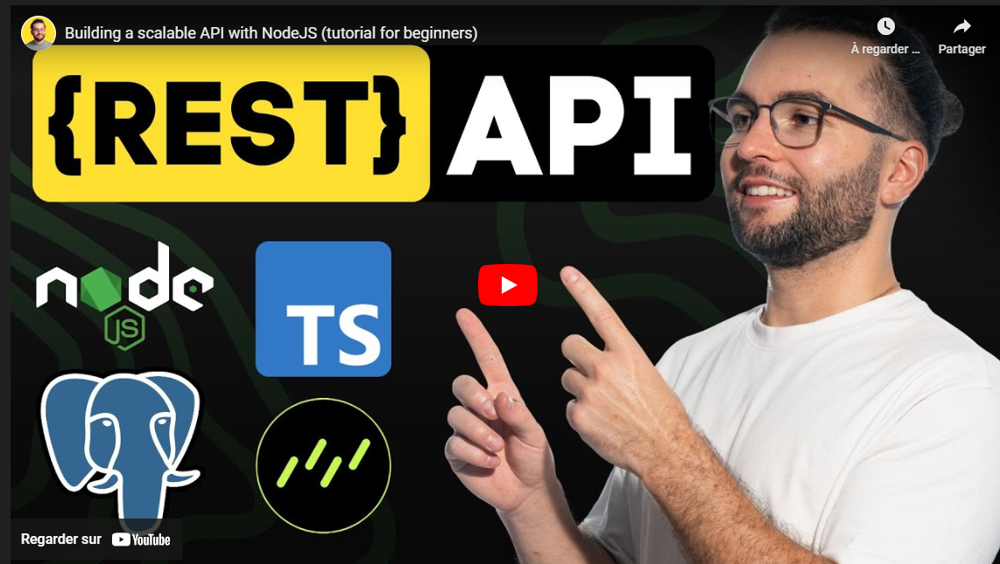
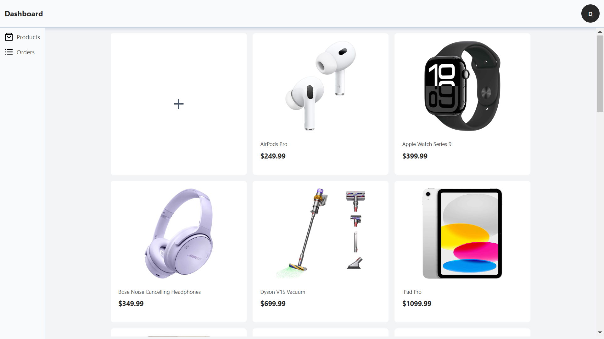

# Fullstack-ecommerce Mobile App

Credits:
Project from [Vadim Savin](https://www.linkedin.com/in/vadimsavin).

The tutorial is available:

- on his website, [NotJust.dev](https://www.notjust.dev/)
- on his Youtube channel, [@notjustdev](https://www.youtube.com/@notjustdev)

It is divided into 4 videos:

1. [Building a Scalable REST API with NodeJS](https://www.notjust.dev/projects/scalable-api-nodejs)
2. [Building an Ecommerce App with React Native, Expo and Gluestack](https://www.notjust.dev/projects/ecommerce-app-ui)
3. [Integrate Stripe Payments in Your React Native Ecommerce App](https://www.youtube.com/watch?v=DsXz90g7gEk)
4. [Build an Ecommerce Admin Dashboard with Next.js](https://www.notjust.dev/projects/ecommerce-admin-dashboard)

The complete project guide is available here: [Complete guide link](https://assets.notjust.dev/ecom)

I updated some of the dependencies \*, added some features, adapted some UI and fixed some bugs.

\* _The dashboard is NOT updated to NEXT 15 + React 19 because of `gluestack-ui`. One of its dependency is not compatible with React 19 yet, I mean `react-native-web`_.

I hope you'll like the result!

## Table of Contents

- [Fullstack-ecommerce Mobile App](#fullstack-ecommerce-mobile-app)
  - [Table of Contents](#table-of-contents)
  - [Description](#description)
  - [Features](#features)
  - [Project Start](#project-start)
  - [RESTful API](#restful-api)
    - [API - Technologies Used](#api---technologies-used)
    - [API - Installation instructions](#api---installation-instructions)
    - [API - Deployment instructions](#api---deployment-instructions)
  - [Mobile App](#mobile-app)
    - [Mobile App - Technologies Used](#mobile-app---technologies-used)
    - [Mobile App - Installation instructions](#mobile-app---installation-instructions)
    - [Mobile App - Deployment instructions](#mobile-app---deployment-instructions)
  - [Dashboard](#dashboard)
    - [Dashboard - Technologies Used](#dashboard---technologies-used)
    - [Dashboard - Installation instructions](#dashboard---installation-instructions)
    - [Dashboard - Deployment instructions](#dashboard---deployment-instructions)

## Description

This is a fullstack ecommerce mobile app built with React Native, Expo, and various other technologies. It provides users with a seamless shopping experience, allowing them to browse products, add items to their cart, complete purchases using Stripe payment integration and view their order history. Sellers can also manage their products and orders through a dashboard.

## Features

- **Authentication**: users & sellers can create an account, log in, and log out.
- **Authorization**: users can access protected screens only after authentication and sellers have a specific role for dashboard access.
   
- **Product Catalog**: users can browse a catalog of products and view details about each product.
- **Cart Management**: users can add products to their cart and proceed to checkout.
- **Payment Integration**: users can complete purchases using Stripe payment integration in test mode.
- **Order Management**: users can view their order history, the products included in each order, and the status of each order.
   
- **Dashboard**: sellers can create, update, delete products, and manage users orders.

## Project Start

Clone the repository in your favorite IDE _as VSCode, IntelliJ IDEA, etc._:
`git clone https://github.com/legendapp/fullstack-ecommerce.git`

## RESTful API

_Credits: picture from Vadim Savin_

### API - Technologies Used

- [**Node.js**](https://nodejs.org/en/download): a free, open-source, cross-platform JavaScript runtime environment.
- [**Express**](https://expressjs.com/): a fast, unopinionated, minimalist web framework for Node.js.
- [**Drizzle ORM**](https://orm.drizzle.team/docs/get-started): a headless TypeScript ORM for Postgres.
- [**Node Postgres**](https://node-postgres.com/): a relational database management system.
- [**Zod**](https://zod.dev/?id=installation): a schema validation library.
- [**Genezio**](https://genezio.com/docs/getting-started/): a cloud deployment platform for serverless functions.

### API - Installation instructions

1. Go to the api directory:`cd api`
2. Install the dependencies: `npm install`
3. Create a `Drizzle ORM` account and create a `Postgres database` according to the instructions given in the **API** video.
   📍Note: to open `Drizzle Studio` via Chrome on Windows 11, install `mkcert` and generate **a locally signed SSL certificate**
4. Create an `.env` file in the `api` directory where you will define the following environment variables:
   - `DATABASE_URL`: your **Postgres** database URL
   - `JWT_SECRET`: a secret key for **JWT** authentication
   - `STRIPE_PUBLISHABLE_KEY`: your **Stripe** publishable key from test mode
   - `STRIPE_SECRET_KEY`: your **Stripe** secret key from test mode
   - `STRIPE_WEBHOOK_SECRET`: your **Stripe** webhook secret key
   - `PORT`: the port number for the **API server**
   - `NODE_ENV=dev` for **development** only
5. Start the API server: `npm run dev`. The API server will start at `http://localhost:3000`
6. Follow the **API** video until the end.

### API - Deployment instructions

1. Go to the root of the project, create the `genezio.yaml` file
2. in the terminal, run `genezio deploy`

## Mobile App

_Credits: picture from Vadim Savin_

### Mobile App - Technologies Used

- [**React Native**](https://reactnative.dev/docs/environment-setup): a JavaScript framework for building mobile applications.
- [**Expo**](https://docs.expo.dev/get-started/set-up-your-environment/): a framework for building React Native applications.
- [**Expo Router**](https://docs.expo.dev/router/introduction/): a routing library for React Native applications.
- [**Expo EAS development build**](https://docs.expo.dev/build/introduction/): a cloud development build for Expo applications.
- [**TypeScript**](https://www.typescriptlang.org/): a strongly typed programming language that extends JavaScript.
- [**Nativewind**](https://www.nativewind.dev/overview/): a utility-first CSS framework - Tailwind for React Native.
- [**Gluestack-UI**](https://gluestack.io/): a component library for React Native.
- [**TanStack Query**](https://tanstack.com/query/v5/docs/framework/react/overview): makes fetching, caching, synchronizing and updating server state in your web applications a breeze.
- [**Zustand**](https://zustand.docs.pmnd.rs/getting-started/introduction): a state management library for React for the local cart store.
- [**Stripe**](https://docs.stripe.com/payments/accept-a-payment?platform=react-native): a payment processing platform.

### Mobile App - Installation instructions

1. Go to the ecommerce-mobile directory: `cd ecommerce-mobile`
2. Install the dependencies: `npm install`
3. Create an `.env` file in the `ecommerce-mobile` directory where you will define the following environment variables:
   - `NEXT_PUBLIC_API_URL`: the URL of the deployed **Genezio API server** to **avoid launching the API server locally**
4. create an EAS development build: see the [EAS documentation](https://docs.expo.dev/build/setup/)
5. Install the **apk** on your physical device or a simulator and run: `npm run start`

   📍Note: if you are on a physical **Android** device, the **Stripe payment sheet**, in **Test Mode**, will open correctly only using an **EAS development build** or an Android simulator. There is no compatibility with Expo Go.

6. Test the **Stripe payment sheet** with:
   - Stripe Payment Intent - **_Succeed_**
     - <u>number</u>: `4242 4242 4242 4242`
     - <u>date</u>: after the current day, e.g. `02/2030`
     - <u>CVC</u>: any, e.g. `123`
   - Stripe Payment Intent - **_Failed_**
     - <u>number</u>: `4000 0000 0000 9995`
     - <u>date</u>: after the current day, e.g. `02/2030`
     - <u>CVC</u>: any, e.g. `123`

### Mobile App - Deployment instructions

- **development** mode:

  - create an **EAS development build** and
  - install the **apk** on a physical device or a simulator.

- **live** mode:

  - for **IOS**, create an **Apple App Store** developer account and follow the guide
  - for **Android**, create an **Android Playstore** developer account and follow the guide

## Dashboard

### Dashboard - Technologies Used

- [**Nextjs**](https://nextjs.org/docs/14/getting-started/installation): a framework for building web applications.
- [**TanStack Query**](https://tanstack.com/query/v5/docs/framework/react/overview): makes fetching, caching, synchronizing and updating server state in your web applications a breeze.
- [**Zustand**](https://zustand.docs.pmnd.rs/getting-started/introduction): a state management library for React for the local cart store.
- [**Genezio**](https://genezio.com/docs/getting-started/): a cloud deployment platform for serverless functions.

### Dashboard - Installation instructions

📍Note for Windows Developers: [No support for Windows + NEXTJS ISR](https://genezio.com/docs/frameworks/nextjs/)
📍Solution: develop with the same configuration as mine, a `Windows 11 + WSL2 + Ubuntu 22.04 LTS + Node 22.13.0 LTS + npm 11.0.0` environment.

1. Go to the dashboard directory: `cd dashboard`
2. Install the dependencies: `npm install`
3. Create an `.env` file in the `dashboard` directory where you will define the following environment variables:
   - `NEXT_PUBLIC_API_URL`: the URL of the deployed **Genezio API server**
   - `JWT_SECRET`: the secret key for **JWT** authentication, **same as the one in your API** `.env` **variables**
4. Start the development server: `npm run dev`
5. Follow the tutorial until the end.
6. Once you have signed up, go to the **Genezio dashboard**, find the database, find the menu `view data` with a right-click on the three dots on the right, and then find the `users table` and update its **role** to `seller`.

### Dashboard - Deployment instructions

1. create the `genezio.yaml` file at the root of the **dashboard** project,
2. in the terminal, run `genezio deploy`

📍Note: as **Genezio** does not support **NEXTJS Instant Server Regeneration**, updating the **Product List** after a **product is created** requires a `genezio deploy`
